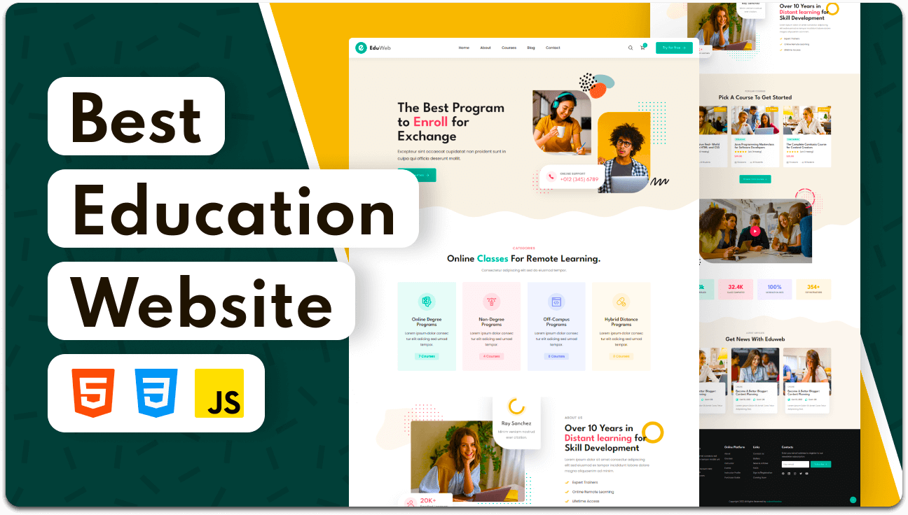

<div align="center">
  
  
  
  
  [](https://twitter.com/intent/follow?screen_name=ayan878)
<!--   [](https://youtu.be/x26bQPxcFX4) -->

  <br />
  <br />

  <h2 align="center">eduweb - Education Website</h2>

EduWeb is a fully responsive education website, <br />Responsive for all devices, build using HTML, CSS, and JavaScript.

<a href="https://65a23f3b7f41e797402d3359--glistening-florentine-296718.netlify.app/"><strong>➥ Live Demo</strong></a>

</div>

<br />

### Demo Screeshots



### Prerequisites

Before you begin, ensure you have met the following requirements:

- [Git](https://git-scm.com/downloads "Download Git") must be installed on your operating system.

### Run Locally

To run **EduWeb** locally, run this command on your git bash:

Linux and macOS:

```bash
sudo git clone https://github.com/ayan878/eduweb.git
```

Windows:

```bash
git clone https://github.com/ayan878/eduweb.git
```

### Contact

If you want to contact with me you can reach me at [Twitter](https://www.twitter.com/ayan878_ayan).

### License

This project is **free to use** and does not contains any license.

# Web-Socket

**HTTP**: HTTP (Hypertext Transfer Protocol) is a communication protocol widely used in web development. It facilitates communication between the frontend (client) and the backend (server) to perform operations such as fetching, posting, or updating data. This communication is typically handled through REST-APIs (Representational State Transfer APIs), which connect the frontend and backend via temporary links.

- **Temporary Connection**: In HTTP, a connection is established when a request is sent from the client to the server. The server processes the request, sends back a response, and then the connection is closed. This type of connection is known as an HTTP connection.
- **One-Way Communication**: HTTP is a one-way communication protocol where either the client sends a request to the server, and the server responds back to the client.
- **Stateless Protocol**: HTTP is stateless, meaning each request is independent and unrelated to previous requests. Each time a request is made, the connection is established with specific headers, and there is no persistent storage of connection data.

### WebSocket

In contrast to HTTP, WebSocket provides full-duplex communication channels over a single, long-lived connection. This allows for more efficient and interactive communication between the client and server.

- **Persistent Connection**: WebSocket establishes a persistent connection between the client and the server. Once the connection is established, it remains open, allowing for continuous data exchange.
- **Two-Way Communication**: Unlike HTTP, WebSocket enables two-way communication. Both the client and the server can send and receive messages independently of each other, providing real-time updates.
- **Stateful Protocol**: WebSocket maintains the connection state, allowing for a continuous exchange of data without the need to re-establish the connection for each communication.

### Example Use Cases for WebSocket

- **Real-Time Applications**: WebSocket is ideal for applications that require real-time data updates, such as chat applications, live sports updates, and online gaming.
- **Collaborative Tools**: Tools that involve real-time collaboration, such as shared document editing or whiteboarding applications, benefit from WebSocket's persistent connection.
- **Streaming Services**: WebSocket is used in streaming services for real-time audio, video, and data streams.

By using WebSocket, developers can create more interactive and responsive web applications that provide a seamless user experience through real-time communication.